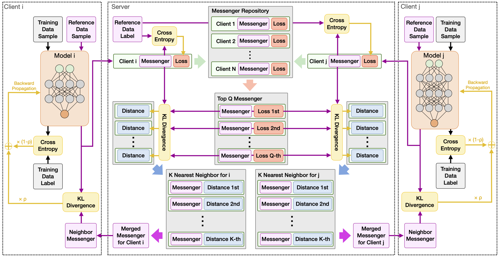

SQMD
==
  
Code for [Heterogeneous Collaborative Learning for Personalized Healthcare Analytics via Messenger Distillation](https://arxiv.org/abs/2205.13705).

Abstract
-
The Healthcare Internet-of-Things (IoT) framework aims to provide personalized medical services with edge devices. Due to the inevitable data sparsity on an individual device, cross-device collaboration is introduced to enhance the power of distributed artificial intelligence. Conventional collaborative learning protocols (e.g., sharing model parameters or gradients) strictly require the homogeneity of all participant models. However,  real-life end devices have various hardware configurations (e.g., compute resources), leading to heterogeneous on-device models with different architectures.  Moreover,  clients (i.e., end devices) may participate in the collaborative learning process at different times.

In this paper, we propose a Similarity-Quality-based Messenger Distillation (SQMD) framework for heterogeneous asynchronous on-device healthcare analytics. By introducing a preloaded reference dataset, SQMD enables all participant devices to distill knowledge from peers via messengers (i.e., the soft labels of the reference dataset generated by clients) without assuming the same model architecture. Furthermore, the messengers also carry important auxiliary information to calculate the similarity between clients and evaluate the quality of each client model, based on which the central server creates and maintains a dynamic collaboration graph (communication graph) to improve the personalization and reliability of SQMD  under asynchronous conditions. Extensive experiments on three real-life datasets show that SQMD achieves superior performance.

Architecture
-


Cite Our Paper
-
```
coming soon
```
